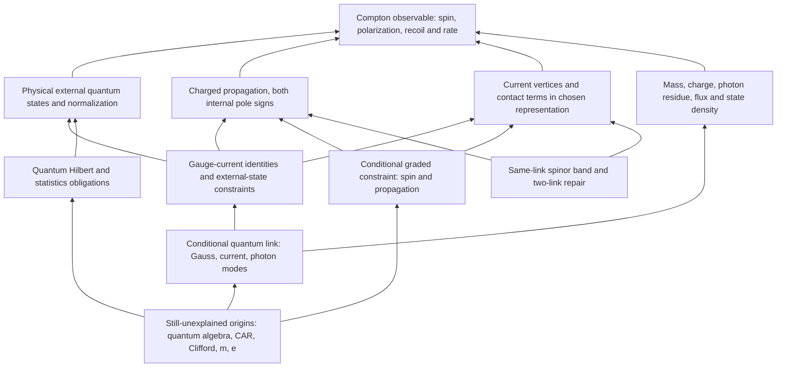

# P256 — work backward from interacting QED

Issue [#222](https://github.com/vantasnerdan/substrate-framework/issues/222).
**First worked deliverable: reference + backward dependency map + attempted,
iterated conditional construction. Not a completed electron–photon explanation.**
Research was resumed by direct owner instruction after the issue's paused
revision. The retired #203 campaign's single-Euler/neutrino restrictions do not
apply. Baseline: `14e0b08f6099698b6d117840e65f86cbe70d4efb`.

## Start at the observable, not a microscopic root

The target is leading-order Compton scattering `e^- gamma -> e^- gamma`,
initial electron at rest, explicitly resolved or averaged spin/polarization.
Its tree amplitude is order `e^2`, its differential cross section order
`e^4=16 pi^2 alpha^2`. The selected numerical reference uses `m=e=1` as
calculation units; it does **not** derive the measured electron mass/charge or
assert precision agreement with experiment beyond this perturbative scope.

The reference laboratory prediction is

\[
\frac{\omega'}\omega=\frac1{1+(\omega/m)(1-\cos\theta)},\qquad
\frac{d\sigma}{d\Omega}=\frac{\alpha^2}{2m^2}
\left(\frac{\omega'}\omega\right)^2
\left(\frac\omega{\omega'}+\frac{\omega'}\omega-\sin^2\theta\right).
\]

Its low-energy limit is Thomson scattering,
`d sigma/d Omega = alpha^2(1+cos^2 theta)/(2m^2)`. A classical transverse wave,
a persistent lump or matching this one coefficient does not supply the
quantum interacting electron–photon sector.

### Backward dependency map



This is a working decomposition, not an assertion that independent suppliers
can be glued without feedback. The code returns to the **joined scattering
consumer**, where band, current, contact, external states and kinematics have
to agree. [reference.md](reference.md) derives the amplitude, trace and
phase-space normalization and gives the detailed dependency/input ledger.

## Construct and discriminate the coupled relationship

The first uncertain interface is propagation ↔ current ↔ spin/contact response.
An arbitrary matter band and an arbitrary photon vertex need not satisfy the
same charge-current identity. Gauge compatibility alone also does not fix
transverse magnetic couplings, exchange statistics or rest/inertial mass.

Three explicit conditional constructions investigate that relationship:

- [constraint.md](constraint.md), [constraint.py](constraint.py): a graded
  spinning constraint closes only with its associated magnetic term. Clifford
  quantization gives the Dirac numerator and conditional minimal `g=2`.
  Second-order contact **and numerator endpoint** contributions map exactly
  back to first-order Compton. A gauge-compatible Pauli deformation remains
  possible; neither gauge invariance nor Grassmann variables derive CAR.
- [quantum_supplier.md](quantum_supplier.md),
  [quantum_supplier.py](quantum_supplier.py): an exact quantum star sector
  computes Gauss-preserving hopping and an exchange loop. A bosonic substitution
  preserves the gauge structure but changes the exchange sign. The same link
  Hamiltonian's distinct weak-field cubic sector supplies two transverse quantum
  modes and harmonic Coulomb response **under imported quantization and phase
  assumptions**; it does not supply a Dirac electron.
- [lattice_compton.md](lattice_compton.md),
  [lattice_compton.py](lattice_compton.py): a declared spinor link Hamiltonian
  joins the bands, same-link Peierls vertices, required two-photon contact and
  actual tree scattering kernel. It also derives a finite-model rate with
  photon group-velocity flux and the energy-delta radial Jacobian. CAR,
  Clifford matrices and quantum photon normalization are inputs, not explained
  endpoints. At finite spacing its angle is outgoing **wave-vector** angle,
  not automatically an experimental ray angle.

### Iteration driven by the target

The nearest Wilson mass is
`M_a(p)=m+(r/a) sum_i(1-cos(ap_i))`. Its rest gap is `m`, but

\[
\frac1{m_{\rm kin}}=\frac{v^2}{m}+ra,
\qquad\frac{\overline{|M|^2}_{\rm soft}}
 {2e^4(1+\cos^2\theta)}=(v^2+ram)^2.
\]

This is an observable mismatch, not a broken Ward identity. It selects two
repairs that are actually constructed and tested:

| Attempt | Target result | What it earns / what it does not |
|---|---|---|
| Nearest Wilson, `v=r=m=1`, `a=.1` | Soft squared-amplitude ratio `1.21000000003`; finite-energy ratio `1.20931564876` | Gauge-compatible conditional band, but wrong soft rest/inertial relation at finite spacing |
| Tune `v=sqrt(.9)` at `a=.1` | Soft ratio `1.00000000002`, finite-energy ratio `0.989809480563` | Repairs one coefficient, **not** the full interaction or common relativistic speed |
| Gauge-covariant nearest + two-link mass `m+(r/a) sum(1-cos ap)^2` | Soft ratio `1.00000000002`; finite-energy rate converges to QED | Cancels quadratic mass curvature while keeping doubler corners heavy; vertices/contact change together |

Finite-energy entries above use incoming momentum `.4m`, angle `1.1` radians.
The continuum incoming photon energy is `.4m`; the finite model uses its own
photon energy and charged recoil. No finite-model kinematics are silently
replaced by QED kinematics.

The second repair is a materially different gauge-covariant operator, not
simply a tuned Thomson coefficient. Deleting its contact term preserves the
free spectrum but breaks the discrete Ward cancellation. Setting `r=0` removes
the curvature too, but leaves eight light spatial Dirac cones; it is not an
acceptable hidden species change.

## Executed quantitative evidence

`results.json` records actual outputs, runtime versions, exact artifact SHA256
values and the baseline. The first composed run exited naturally with code 0;
all reference, constraint, quantum-supplier and joined-kernel CLIs completed.
An additional resolved-state calculation was then executed and is included in
the final composed command below. The calculations are deterministic small
matrix, symbolic-algebra and harmonic-field probes, not experimental data.

### Reference controls

- Explicit spinor/polarization sums reproduce analytic Klein–Nishina over
  `omega/m=.01,.1,.5,1` and angles `0,45,90,135,180` degrees; maximum measured
  relative difference `2.66427e-15`. Independent physical and covariant spin
  traces are also checked.
- At `omega/m=.4`, `theta=60°`, keeping only either channel gives incoming
  Ward residual `0.3407771`; the coherent pair cancels to roundoff.
- A `kappa=.3` Pauli-EFT control (`g=2.6`) still satisfies Ward identities and
  tends to the same Thomson limit, but changes the selected unpolarized
  squared amplitude from `2.56666667` to `2.67175167` and a resolved component
  by `0.2155415 e^2`. This is a concrete Thomson/gauge false positive, **not**
  a radiative-QED prediction.

### Joined two-link rate convergence

Selected input: `m=e=r=v=c_gamma=1`, incoming spatial momentum `.4`, `theta=1.1`.
The reference rate is `0.00265465134218` in the calculation units.

| `am` | Relative reduced squared-amplitude error | Relative differential-rate error |
|---:|---:|---:|
| .2 | `9.91764e-4` | `7.53733e-4` |
| .1 | `2.78391e-4` | `1.77484e-4` |
| .05 | `7.33720e-5` | `4.30347e-5` |
| .025 | `1.88121e-5` | `1.05942e-5` |
| .0125 | `4.76149e-6` | `2.62815e-6` |
| .00625 | `1.19767e-6` | `6.54499e-7` |

Both lattice Ward contractions cancel to roundoff. At `a=.1`, omitting the
contact gives residual `6.21190e-5` instead. An **untuned complementary set**
uses `omega/m=.05,.4,1,2`, angles `.2,.7,1.5,2.6`, axis and `(1,2,3)` incoming
orientations, and `(m,e)=(1,1),(2,.3)`. At `am=.0125` the maximum relative
rate deviation is `5.62527e-4`. This bounds only those selected inputs, not all
energies/frames. Finite-scale anisotropy remains visible and shrinks with a.

### Resolved quantum-state map and internal pole falsifier

[spin_transfer.py](spin_transfer.py) compares linear **and complex circular**
photon states and fixed-z boosted electron-spin components with the reference,
using explicitly matched basis conventions and candidate on-shell states.
Over its selected energies/angles/orientations the maximum absolute component
error `|Delta M|/e^2` decreases:

| `am` | Maximum resolved component error |
|---:|---:|
| .05 | `.0169409554` |
| .025 | `.00433680527` |
| .0125 | `.00109618859` |

Deleting internal negative-energy poles at `a=.1`, momentum `.4`, angle `1.1`
changes the selected reduced amplitude by `.179789429` and leaves incoming
Ward residual `.321459495`. Having only external positive-energy electrons
does **not** license discarding the full internal Dirac-band resolvent.

### Quantum/constraint discriminators

- Exact graded `QQ+2iH=0` and `QH=0` for six independent constant field
  components; deleting the magnetic term fails. Differential Landau-gauge
  operator squaring and the full anomalous square also agree.
- At `m=e=1`, `B=.1`, the same-orbital spin energies are `1` and `sqrt(6/5)`;
  deleting the Pauli term gives the wrong degeneracy `sqrt(11/10)`.
- Second-order mixed resolvent equals first-order only when both contact and
  endpoint contributions are kept; each deletion is tested independently.
- Gauge-covariant quantum hopping has zero physical Gauss violation; bare
  hopping evolves to `<sum G^2>=1.35665967` at the selected time `.7`.
- A legal closed exchange has matrix-element product `-1` with imported CAR,
  `+1` with commuting-site hard-core bosons. The latter passes the same Gauss
  structure; it is a real false positive for a proposed electron identity.
- The harmonic photon kernel has two physical modes at nonzero momenta;
  neutral harmonic Coulomb response has Gauss residual `6.76542e-17` and exact
  numerical field/source energy agreement. Compact-phase stability is not proved.
- Independent review exposed an absolute eigenvalue floor that erased very soft
  nonzero photon modes. The corrected relative-gap classification restores two
  modes at `|k|=1e-8,1e-10` and keeps exact zero momentum separate as global modes.

## Reproduce at the actual consumer

Use Python 3.11+ with the repository's declared NumPy, SciPy and SymPy dependencies.
The exercised environment was Python 3.12.3, NumPy 2.5.3, SciPy 1.18.1,
SymPy 1.14.0. From the repository root, in that environment:

```sh
python proposals/P256-qed-backward/integrate.py \
  --output proposals/P256-qed-backward/results.json
```

This launches each actual calculation as a subprocess, checks its natural
exit, parses its JSON and preserves runtime/artifact identity. Individual
scripts are also directly executable with the same Python interpreter. No
new canonical physics claim, source API, package release or experimental
result is asserted by a successful run.

## Explanatory debt and continuation

| Obligation | Supplied here | Still unassigned / not derived |
|---|---|---|
| Photon physical states | Quantized two-mode harmonic sector **conditionally** | Origin of quantum algebra/gauge constraint and compact-phase transfer |
| Charged spin-1/2 propagation | Graded/Clifford interface and spinor band **conditionally** | Why a deeper supplier has this band and state map |
| Fermionic statistics | CAR representation and exchange discriminator | Origin of CAR or a demonstrated composite exchange mechanism |
| Current/interaction | Same-link propagation–vertex–contact relationship and Compton consumer | Microscopic supplier transfer, renormalized/infrared completion |
| Mass and charge | Declared inputs, normalized maps; rest/inertial mismatch exposed | Measured mass/charge origin; not inferred from setting `m=e=1` |
| Spacetime | Matched-speed controlled continuum bands/kernel, finite-a corrections shown | Why speeds match; no finite-lattice exact Lorentz claim |
| Wider SM | QED reference regime only | Higgs/electroweak origin outside this first artifact; neutrinos deferred |

Charged asymptotic dressing and infrared resolution beyond tree order remain
visible in [reference.md](reference.md). Nothing here derives renormalized
radiative corrections by adding a free Pauli coefficient.

The next backward construction must replace an actual imported block—quantum
state algebra, CAR/charged spin structure or parameter origin—with a supplier
and a demonstrated transfer that survives this **same** scattering consumer.
More coefficient tuning is not that explanation. The nonexclusive source
library remains available; these conditional successes do not exhaust it.
The campaign stays scientifically open. Independent scoped reviews are stored
under `reviews/`; they assess exact artifacts, not permission to merge or close.
