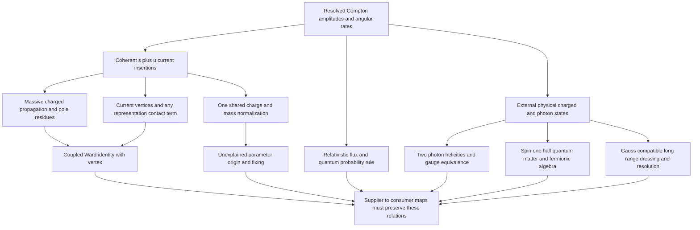

# Compton reference: observable first, suppliers second

**Scope:** a worked, conditional tree-QED reference for [issue #222](https://github.com/vantasnerdan/substrate-framework/issues/222), plus its backward dependency map. The equations below derive a benchmark **within imported QED**, not a microscopic electron, photon or interaction mechanism. `compton.py` implements the spin/polarization amplitudes independently of the analytic comparator. Numerical outputs and their verification belong to the actual CLI/integration run; none are asserted here before execution. Quantum interacting-sector explanation remains the campaign goal.

## 1. Start with a measurable target

Select free-electron Compton scattering

\[
e^-(p,s)+\gamma(k,\lambda)\longrightarrow e^-(p',s')+\gamma(k',\lambda')
\]

in the initial-electron rest frame, with the outgoing photon angle \(\theta\) relative to the incoming photon. The most informative initial target is the **spin/polarization-resolved amplitude and its interference**, with the unpolarized angular cross section as a experimentally accessible projection. The Thomson limit is a useful normalization check but cannot identify the electron's quantum/spin structure by itself.

Use \(\eta=\operatorname{diag}(1,-1,-1,-1)\), \(\hbar=c=1\), \(q_e=-e\), \(e>0\), and \(\alpha=e^2/(4\pi)\). The CLI defaults \(m=e=1\) are algebraic reference units, **not** measured electron parameters or physical \(\alpha\). In this convention \([m]=[\omega]=1\), \([e]=0\), \([u]=1/2\), \([\mathcal M]=0\), \([\sigma]=-2\).

### Regime and kinematics

Assume an isolated target electron, no binding or medium corrections, two real photons, and positive-energy on-shell external electrons:

\[
p=(m,\mathbf0),\quad k=(\omega,0,0,\omega),\quad
k'=(\omega',\omega'\sin\theta,0,\omega'\cos\theta),\quad
p'=p+k-k'.
\]

From \(p'^2=m^2\), \(k^2=k'^2=0\),

\[
m(\omega-\omega')=\omega\omega'(1-\cos\theta),\qquad
R\equiv\frac{\omega'}{\omega}
=\frac{1}{1+x(1-\cos\theta)},\qquad x=\omega/m.
\]

The default comparison spans \(x=0.01,0.1,0.5,1\) and \(\theta=0,45,90,135,180\) degrees. With an **imported** physical electron mass near \(511\,\mathrm{keV}\), these correspond to approximately \(5.11\)–\(511\,\mathrm{keV}\) incident photons. Soft convergence uses \(x=10^{-1},10^{-2},10^{-3},10^{-4}\) at \(60\) degrees. This is a stated Born benchmark, not a precision claim for data: there are no loops, detector cuts or unresolved-radiation integrals in the calculation. The mathematical tree formula extends beyond this grid, but that is not validation of a high-energy physical approximation.

## 2. Recover the amplitude and the structures it uses

### External states and normalization

The photon states have two physical helicities; a real linear-polarization basis is an equivalent basis for their two-dimensional state space. Choose representatives satisfying

\[
\epsilon^0=0,\quad k\cdot\epsilon=0,\quad
\epsilon_\lambda^*\cdot\epsilon_{\lambda'}=-\delta_{\lambda\lambda'},\quad
\epsilon\sim\epsilon+\zeta k.
\]

`polarizations(k)` projects the Cartesian axis least aligned with \(\mathbf k\) onto the transverse plane, then uses \(\hat{\mathbf k}\times\mathbf e_1\). Its labels are **basis indices**, not photon helicities. The CLI also constructs complex circular polarizations to exercise outgoing conjugation and gauge shifts; basis-dependent channel phases must not be interpreted as absolute measured phases.

For the electron use the Dirac Clifford algebra \(\{\gamma^\mu,\gamma^\nu\}=2\eta^{\mu\nu}\) and

\[
u_s(p)=\sqrt{p^0+m}
\begin{pmatrix}
\chi_s\\ \dfrac{\boldsymbol\sigma\cdot\mathbf p}{p^0+m}\chi_s
\end{pmatrix},\quad
\chi_0=\begin{pmatrix}1\\0\end{pmatrix},\quad
\chi_1=\begin{pmatrix}0\\1\end{pmatrix}.
\]

These are rotation-free boosts of rest-frame \(+z/-z\) spin, **not** electron helicities. They obey

\[
(\not p-m)u_s(p)=0,\quad \bar u_su_s=2m,\quad
u_s^\dagger u_s=2p^0,\quad
\sum_s u_s(p)\bar u_s(p)=\not p+m.
\]

Use relativistic external-state normalization
\(\langle\mathbf p,s|\mathbf q,r\rangle=2p^0(2\pi)^3\delta^3(\mathbf p-\mathbf q)\delta_{sr}\), analogously for photons, and
\(S_{fi}=i(2\pi)^4\delta^4(P_f-P_i)\mathcal M_{fi}\) for the connected transition. These quantum state/Born-rule assumptions are imported, not established by the matrix computation.

### Two coherent orderings, one current

With \(\mathcal L_{\rm int}=-q_e\bar\psi\gamma^\mu\psi A_\mu\), the electron vertex is \(+ie\gamma^\mu\). Two such vertices and one internal fermion propagator give, in our overall-sign convention,

\[
\boxed{\mathcal M_{s'\lambda';s\lambda}=-e^2\bar u_{s'}(p')
\left[
\not\epsilon'^*\frac{\not p+\not k+m}{2p\cdot k}\not\epsilon
+\not\epsilon\frac{\not p-\not k'+m}{-2p\cdot k'}\not\epsilon'^*
\right]u_s(p).}
\]

The denominators are \(s-m^2=2p\cdot k\) and \(u-m^2=-2p\cdot k'\), with \(s=(p+k)^2\), \(u=(p-k')^2\). The two terms have the same combinatorial sign: this is one charged fermion line with the two photon insertions exchanged, not an exchange of two external fermions. The minus sign in the second denominator is kinematic. An overall amplitude sign is conventional; changing the **relative** sign changes the physics.

This construction immediately requires more than separately matching a matter dispersion and a transverse wave: **the pole numerators, propagator denominators, vertices and external-state equations have to be compatible on the same line**. The coherent sum, not a sum of channel probabilities, is the consumer.

### Both on-shell Ward cancellations

Write \(D(r)=\not r-m\), \(S(r)=D(r)^{-1}=(\not r+m)/(r^2-m^2)\), \(r=p+k\), \(\ell=p-k'\). At this nonsingular tree kinematics omit the irrelevant \(i0\) notation. Replacing the incoming polarization by momentum gives

\[
S(r)\not k\,u(p)=S(r)[D(r)-D(p)]u(p)=u(p),
\]
\[
\bar u(p')\not k\,S(\ell)
=\bar u(p')[D(p')-D(\ell)]S(\ell)=-\bar u(p').
\]

Thus the s and u terms reduce to equal and opposite \(\bar u(p')\not\epsilon'^*u(p)\): \(\mathcal M(\epsilon\to k)=0\).

Independently, replacing the outgoing polarization by \(k'\),

\[
\bar u(p')\not k' S(r)=\bar u(p')[D(r)-D(p')]S(r)=\bar u(p'),
\]
\[
S(\ell)\not k' u(p)=S(\ell)[D(p)-D(\ell)]u(p)=-u(p),
\]

so \(\mathcal M(\epsilon'\to k')=0\). A surviving individual term is generally nonzero; cancellation is not a property of either isolated diagram.

The off-shell organizing identity, for a charge-stripped vertex and compatible full propagator, is

\[
Q_\mu\Gamma^\mu(p+Q,p)=S^{-1}(p+Q)-S^{-1}(p).
\]

At tree level \(\Gamma^\mu=\gamma^\mu\). Beyond tree level this is a relation between **jointly corrected** objects, not permission to combine an arbitrary matter propagator with an imported bare vertex. At the two-photon level, contact terms in alternate/nonrelativistic/lattice representations must transform consistently too. Minimal continuum Dirac QED has no independent elementary \(A^2\bar\psi\psi\) vertex; this does not imply every representation is seagull-free.

## 3. Spin trace, Klein–Nishina and the exact flux factor

Let \(K(\epsilon,\epsilon')\) denote the bracket in the boxed amplitude and \(\overline K=\gamma^0K^\dagger\gamma^0\). Spin completeness gives

\[
\overline{|\mathcal M|^2}
=\frac{e^4}{4}\sum_{\lambda,\lambda'}
\operatorname{tr}[(\not p'+m)K(\not p+m)\overline K].
\]

The factor \(1/4\) averages **two initial electron spins and two initial photon polarizations**. All final spins and physical photon polarizations are summed, not averaged. A fixed initial spin/polarization channel has no such factor.

To reduce the trace covariantly, the already-demonstrated Ward identities allow
\(\sum_\lambda\epsilon_\mu\epsilon_\nu^*\to-\eta_{\mu\nu}\) for the **complete** amplitude. In particular, defining

\[
T^{\nu\mu}=\gamma^\nu S(p+k)\gamma^\mu
+\gamma^\mu S(p-k')\gamma^\nu,
\]

one contracts

\[
\frac{e^4}{4}\eta_{\mu\rho}\eta_{\nu\sigma}
\operatorname{tr}[(\not p'+m)T^{\nu\mu}(\not p+m)
\overline T^{\sigma\rho}].
\]

Use \(\operatorname{tr}(\not a\not b)=4a\cdot b\),
\(\operatorname{tr}(\not a\not b\not c\not d)=4[(a\cdot b)(c\cdot d)-(a\cdot c)(b\cdot d)+(a\cdot d)(b\cdot c)]\),
\(\gamma_\mu\not a\gamma^\mu=-2\not a\), \(\gamma_\mu\not a\not b\gamma^\mu=4a\cdot b\), and the on-shell/momentum-conservation relations. With \(a=p\cdot k\), \(b=p\cdot k'\), including the s–u cross traces, the result is

\[
\overline{|\mathcal M|^2}
=2e^4\left[\frac ab+\frac ba
+2m^2\left(\frac1a-\frac1b\right)
+m^4\left(\frac1a-\frac1b\right)^2\right].
\]

In the rest frame, \(a=m\omega\), \(b=m\omega'\), and
\(m^2(1/a-1/b)=-(1-\cos\theta)\). The last two terms therefore become \(-\sin^2\theta\), yielding

\[
\boxed{\overline{|\mathcal M|^2}=2e^4(R+R^{-1}-\sin^2\theta).}
\]

**Independent computational route:** `unpolarized_squared` explicitly adds the 16 squared gamma/spinor amplitudes and divides by four. `spin_trace_squared` instead uses completeness projectors and physical polarizations. `covariant_trace_squared` uses the metric contraction above. Only `klein_nishina_squared` uses the closed formula. The CLI asserts agreement across these routes; it never generates amplitudes by copying Klein–Nishina. Do not use the covariant polarization replacement to interpret an isolated missing-channel control as a physical probability.

For clarity about dimensions and normalization, start with invariant flux \(4m\omega\) and two-body phase space:

\[
d\sigma=\frac{\overline{|\mathcal M|^2}}{4m\omega}
\frac{d^3p'}{(2\pi)^3 2E'}
\frac{d^3k'}{(2\pi)^3 2\omega'}
(2\pi)^4\delta^4(p+k-p'-k').
\]

Eliminating \(\mathbf p'\), the remaining energy delta has Jacobian
\(1+(\omega'-\omega\cos\theta)/E'
=[m+\omega(1-\cos\theta)]/E'\). Consequently

\[
\frac{d\sigma}{d\Omega}
=\frac{R^2}{64\pi^2m^2}\overline{|\mathcal M|^2}
=\boxed{\frac{\alpha^2}{2m^2}R^2(R+R^{-1}-\sin^2\theta)}.
\]

Here \(\Omega\) is **solid angle**, not photon energy \(\omega\). The code cross-section functions return this lab-frame quantity in inverse mass squared. The CLI additionally checks \(\mathcal M\propto e^2\), \(\overline{|\mathcal M|^2}\propto e^4\), and \(d\sigma/d\Omega\propto e^4/m^2\) at fixed \(x\).

## 4. Thomson: the useful limit and its blind spots

For \(x\to0\), \(R\to1\). In our fixed-spin convention the coherent amplitude has leading term

\[
\mathcal M_{s's}=-2e^2\,
\mathbf\epsilon'^*\cdot\mathbf\epsilon\,\delta_{s's}+O(e^2x).
\]

This follows directly by expanding the two pole numerators and boosted outgoing spinor. Their leading rest-spin blocks contain
\((\boldsymbol\sigma\cdot\mathbf\epsilon'^*)(\boldsymbol\sigma\cdot\mathbf\epsilon)/(2m)\) and the reverse ordering. The Pauli anticommutator removes the leading spin-dependent commutator. Including \(\bar u u=2m\), the sum is \(-2e^2\mathbf\epsilon'^*\cdot\mathbf\epsilon\), not \(-e^2/m\) in invariant-amplitude normalization.

Averaging/summing the polarizations gives

\[
\overline{|\mathcal M|^2}\to2e^4(1+\cos^2\theta),\qquad
\frac{d\sigma_T}{d\Omega}
=\frac{\alpha^2}{2m^2}(1+\cos^2\theta)
=\frac{r_e^2}{2}(1+\cos^2\theta),\quad r_e=\frac{\alpha}{m}.
\]

Integrating yields \(\sigma_T=(8\pi/3)r_e^2\). Thomson data alone measure the combination \(e^2/m\) through the amplitude (its square through the rate), not an independent origin of mass and charge, not the sign of the charge, and not quantum fermionic statistics. Classical charged response and other quantum spin sectors can share this leading result. A one-electron tree experiment never exchanges identical electrons and is not a statistics test. Even a match to the full leading unpolarized curve does not establish radiative structure or an infrared-complete charged sector.

### A transverse Pauli deformation that Ward and Thomson do not reject

Use a **conditional adversary**, not a new proposed root:

\[
\Gamma^\mu(Q)=\gamma^\mu+\frac{i\kappa}{2m}\sigma^{\mu\nu}Q_\nu,
\qquad \sigma^{\mu\nu}=\frac{i}{2}[\gamma^\mu,\gamma^\nu],
\qquad g=2(1+\kappa).
\]

\(Q\) always points **into** the photon vertex: \(Q=k\) at absorption, \(Q=-k'\) at emission. Thus the contracted vertex used in code is
\(\Gamma(\epsilon,Q)=\not\epsilon-\kappa[\not\epsilon,\not Q]/(4m)\), with outgoing \(\epsilon'^*\). This is the usual \(F_1(0)=1\), \(F_2(0)=\kappa\) form-factor convention for magnetic moment \(\boldsymbol\mu=gq_e\mathbf S/(2m)\).

The Pauli contribution is transverse:
\(Q_\mu\sigma^{\mu\nu}Q_\nu=0\), so \(Q_\mu\Gamma^\mu(Q)=\not Q\). Either Ward replacement still cancels between the two diagrams with the other Pauli vertex left intact. **Gauge invariance does not force \(\kappa=0\).** Fixed finite \(\kappa\) does not change the leading Thomson amplitude; it changes subleading spin/magnetic response. The CLI compares \(\kappa=0\) and \(0.3\), requiring both to converge to the same spin-resolved Thomson term and to pass both Ward directions, while their finite-energy resolved amplitudes must differ. This is a local Dirac–Pauli EFT with no additional form factors/polarizabilities supplied, not a full radiatively corrected QED prediction. For meaningful use it requires \(|\kappa|\omega/m\ll1\) and energies below the unspecified EFT completion scale; \(\kappa=0.3,x=0.4\) is an adverse algebraic comparison, not a fitted electron model.

**Complement necessary to distinguish this blind spot:** determine the magnetic response \(F_2(0)\) or a finite-energy polarized Compton spin asymmetry, rather than checking Thomson or Ward again. Subleading low-energy spin amplitudes depend on the magnetic moment. Physical QED itself generates an anomalous magnetic moment radiatively, so setting tree \(\kappa=0\) does not say physical \(g\) is exactly two. Independent identical-fermion exchange observables are needed for statistics; off-shell/full Ward–Takahashi and radiative observables are needed for quantum vertex/self-energy closure. Which additional benchmark is necessary depends on the unresolved supplier relationship, not on a predetermined microscopic ontology.

## 5. Backward dependency graph and coupled obligations

Read the arrows below **backward from the top observable**, then select possible suppliers. No medium, lattice, rotor or Euler root has been selected to define these requirements.



| Backward obligation | Needed for this benchmark | May separate / must couple | Status of this reference |
|---|---|---|---|
| Observable/probability map | Coherent amplitude, Born rule, preparation and projection onto specified spin/polarization outcomes | Hilbert structure and norm must map with the claimed states | Imported quantum rule; no derivation from deeper dynamics |
| Photon states | Null dispersion, two helicities, gauge equivalence, quantum occupation/state normalization | A classical wave supplier can contribute propagation; quantum photon algebra remains a distinct debt until joined | Imported physical QED photon sector; real transverse basis used computationally |
| Electron sector | Massive spin-1/2 representation, on-shell equations, residues and antiparticle-compatible propagator | A band or classical persistence alone does not establish charged fermionic states; propagation and residue map must join vertices | Imported Dirac/Clifford/CAR sector; mass parameter not explained |
| Interaction/pole pair | Both time orderings with shared charge, correct matrix ordering and crossing | Same propagator and both vertices; any contact term is constrained by the same representation's gauge coupling | Derived tree amplitude within imported QED |
| Gauge/current compatibility | Both on-shell Ward cancellations and off-shell inverse-propagator identity | Cannot be inferred from independent endpoint resemblances; transverse vertex terms remain free | Tree identity demonstrated analytically; Pauli deformation is deliberate nonuniqueness control |
| Charge/mass normalization | Flux, spinor residues, \(q_e=-e\), \(e^4/m^2\) rate normalization | One input charge across current, covariant derivative and photon insertions; inertial response and rest gap must agree in this regime | All inputs declared; no charge sign or mass/charge origin derived |
| Infrared charged state | Electric flux, electromagnetic dressing, finite-resolution detector definition | Long-range Gauss law prevents treating interacting matter and radiation as entirely independent physical suppliers | Explicitly unresolved; no dressing is implemented by a free spinor |
| Lorentz/quantum closure | Frame transformation, locality/causality as appropriate, unitarity, statistics and radiative relations | May be emergent, but corrections and shared regime must be exposed | Lorentz QED structure imported; numerical grid is rest-frame only |
| Complementary discrimination | Magnetic form factor/polarized Compton; exchange statistics; radiative structure | Chosen to test the first unexplained relationship surviving the initial benchmark | Pauli finite-energy discriminator included; no claims that one discriminator closes the sector |

### Select the uncertain relationship, not the root

The earliest falsifiable joined obligation is **whether one supplier/map ties matter propagation, photon insertion vertices and any two-photon contact term together so that the same construction produces the coherent Compton amplitude and its soft normalization**. Independent endpoint likenesses cannot answer it. In particular, a rest-energy gap is not automatically the inertial mass entering a supplier's Thomson response.

This obligation motivates the parent's [conditional lattice Compton attempt](lattice_compton.md): a continuous-time charged band is coupled through the same link paths that generate its one- and two-photon vertices, then evaluated at Compton kinematics. A change to its dispersion must change those vertices/contact terms together. That attempted construction imports quantum Hilbert/CAR/Clifford/gauge structures and does not establish them as emergent. Its surviving or failed numerical checks are evidence at its declared regime only; this reference neither predicts their values nor promotes that attempt to a photon/electron mechanism. Other suppliers remain possible, and failed maps motivate repair or a materially different construction rather than a universal no-go.

## 6. Perturbative order, charged-state subtlety and infrared scope

The benchmark amplitude is \(O(e^2)\); its cross section is \(O(e^4)=O(\alpha^2)\). One-loop Compton amplitudes are \(O(e^4)\), and their interference with the tree amplitude contributes at \(O(e^6)=O(\alpha^3)\) in the rate. Real double-Compton amplitudes are \(O(e^3)\), with rates at the same \(O(\alpha^3)\). A constant Pauli insertion here is an independent EFT deformation, not a replacement for that full correction set.

For finite \(\omega>0\), finite mass and the chosen two-body tree kinematics, the computed result is finite. That is **not** a statement that an exact exclusive interacting electron-plus-one-photon Fock-state S matrix is infrared complete. A charged state carries long-range electric flux; in interacting QED it is an infraparticle, not a strictly isolated Wigner one-particle state with a discrete sharp mass hyperboloid. Free external spinors are a leading perturbative organizing device and not a construction of the full physical dressed electron. The internal tree pole here likewise does not assert an exact isolated dressed-electron pole.

Beyond this reference one must specify the physical measurement, e.g. a resolved outgoing photon/electron bin inclusive over any additional photons below detector energy resolution \(\Delta E\), and consistently combine virtual corrections with unresolved real emission. Alternatively an appropriate dressed-state formulation needs an explicit dressing map and a matching observable. Soft cancellation does not justify omitting the detector definition; charge, dressing, gauge constraints and radiation belong to a coupled interpretation. Bound electrons, recoil/bin acceptance, vacuum polarization, running parameters, weak effects or high-energy logarithmic enhancements are not computed. There is no claimed per-mille/percent experimental accuracy.

## 7. Executable proof obligations and provenance

From the repository root, the executable entry point is:

```sh
/home/administrator/substrate-framework/.venv/bin/python proposals/P256-qed-backward/compton.py
```

It prints JSON only after assertions succeed. It includes:

- selected-energy/angle spin sums, independent physical/covariant traces and analytic Klein–Nishina comparators;
- both momentum-replacement Ward directions over every spin and remaining physical polarization, with residuals divided by \(e^2\omega\) or \(e^2\omega'\) so softness cannot hide a failure;
- nonzero s-only and u-only Ward adverse controls at \(x=0.4,\theta=60\) degrees;
- explicit 16-channel complex amplitudes, circular-polarization conjugation/gauge-shift checks, and charge/mass dimension checks;
- spin-resolved and cross-section Thomson convergence for minimal and Pauli-deformed vertices, with the finite-energy Pauli discriminator.

The shared integration owner runs the numerical smoke after the slices settle. The presence of executable assertions is not a report that they have passed. `--energies` supplies \(\omega/m\), `--angles-deg` supplies lab photon angles, and `--mass`/`--e` override imported normalization. The JSON `checks_passed` is emitted only after real calculations and all checks. It means **these finite reference checks passed**, not scientific establishment of QED from a supplier.

### Inputs and unexplained debt

| Item | Meaning/origin | Derived here? |
|---|---|---|
| \(m,e\) | Imported QED parameters; defaults are reference units, physical values would be measured inputs | No; their origin remains unknown |
| Minkowski/Lorentz and Clifford structure | Imported continuum QED organization of spin and propagation | No |
| Hilbert space, superposition, Born rule, CAR/CCR | Imported quantum/fermion/photon assumptions | No; matrix spin sums do not derive quantum statistics |
| Gauge equivalence, current coupling, Gauss law | Imported QED structure, with concrete tree compatibility consequences | Ward cancellations derived at the specified scope; deeper origin not derived |
| Free external states/LSZ organization | Leading perturbative convention, subject to infrared qualification | Used, not justified as exact interacting charged states |
| Spin averages and phase-space factor | Consequences of declared preparation, normalization and kinematics | Yes, within those assumptions |
| \(\kappa=0.3\) control | Chosen dimensionless Pauli deformation to reject an overstrong inference | Not fitted; no physical electron parameter claim |
| Dressing, parameter origin, microscopic supplier maps | Required by the larger explanatory target | Unresolved by this reference |

### Sources actually consulted

1. [G. Burdman, QFT Lecture 18, §§18.4–18.5](https://fma.if.usp.br/~burdman/QFT1/lecture_18.pdf): Ward identity, two Compton orderings, spin completeness and trace method. Its worked Compton trace takes the high-energy zero-mass limit; the finite-mass reduction and rest-frame normalization are supplied explicitly above, not inferred from that approximation.
2. [M. Gell-Mann and M. L. Goldberger, *Scattering of Low-Energy Photons by Particles of Spin ½*, Phys. Rev. 96 (1954) 1433](https://doi.org/10.1103/PhysRev.96.1433): the **accessible primary abstract**, not the subscription-only full text, states that the first two low-frequency terms depend on charge, mass and magnetic moment and agree with a Dirac equation with anomalous Pauli moment. It supports the discriminator's motivation; the Pauli Ward algebra and executable control are given independently here.
3. [A. Herdegen, *Infraparticle problem, asymptotic fields and Haag–Ruelle theory*, arXiv:1210.1731v2, introduction and §4](https://arxiv.org/abs/1210.1731), [journal DOI](https://doi.org/10.1007/s00023-013-0242-z): charged-state mass-spectrum/dressing subtlety and a conditional algebraic asymptotic construction whose matter/radiation structure does not fully factorize. That paper does not supply a microscopic mechanism for this campaign.
4. [H. T. Li et al., *Compton Scattering Total Cross Section at Next-to-Next-to-Leading Order and Resummation of Leading Logarithms*, arXiv:2511.09330v1, introduction and NNLO calculation](https://arxiv.org/html/2511.09330v1): full-mass perturbative scope, combining real/virtual infrared contributions, on-shell renormalization and high-energy logarithmic qualifications. No numerical result from that work is represented as a result of this CLI.

Literature establishes the stated reference and motivates tests. It neither proves transfer to a deeper supplier nor closes the quantum interacting-sector explanation.
